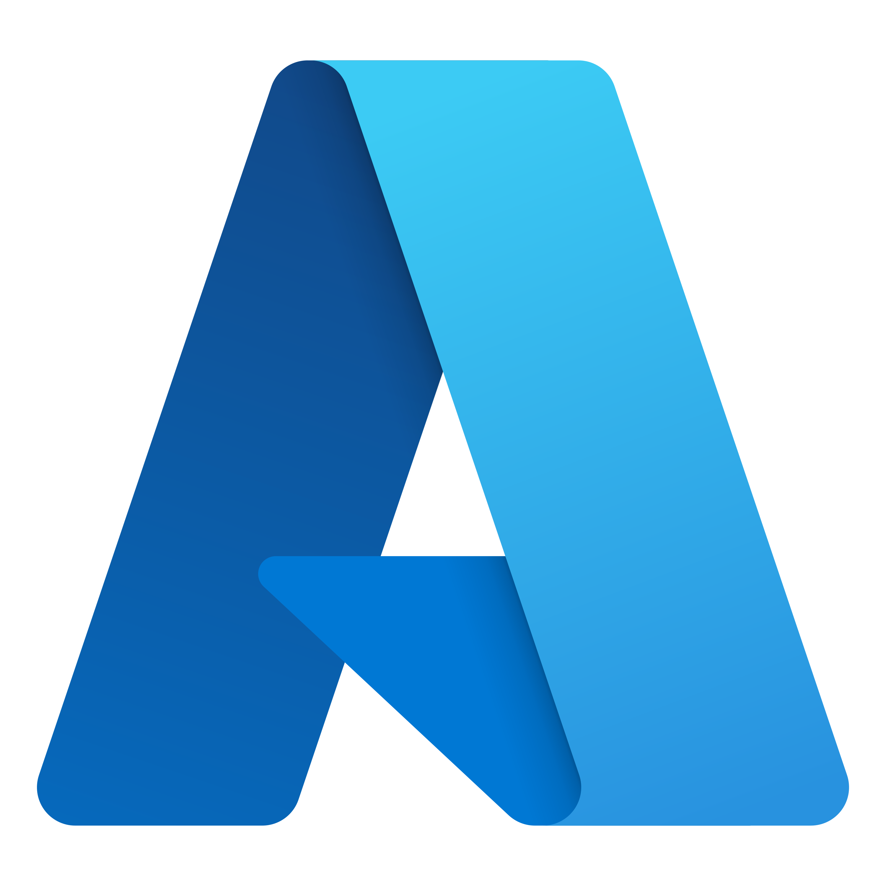
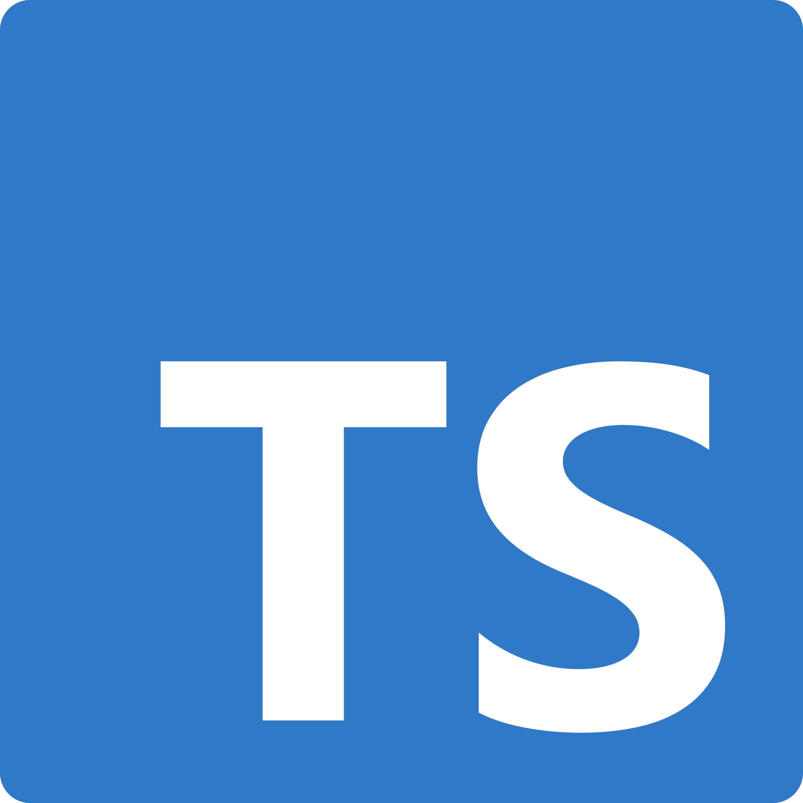
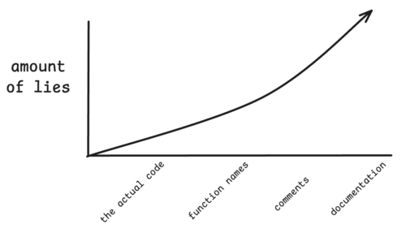

# Hi, I'm Goran, nice to meet you

Welcome to my GitHub! I'm a freelance full-stack software engineer specialized in cloud-based solutions using .NET and Azure. I contribute to many clients' internal shared packages and frameworks on all fronts: frontend, backend, and DevOps.

## 🛠️ My Toolbox

Here are some of the technologies I work with regularly:

  
  
  
  
  

- Languages: C#, JavaScript/TypeScript, Python, Go, Powershell (and Rust, if I ever find the time)
- Frontend: React, Redux, TanStack Query, Webpack, Rspack, Tailwind CSS
- Backend: Microsoft .NET, Python
- Cloud & DevOps: Azure Services (Functions, App Services, Storage), Azure Bicep
- Databases: SQL Server, SQLite, Azure Cosmos Db, Azure Table storage
- Other Tools: Git, Azure pipelines for CI/CD

## 🤖 Agentic Development

Daily drivers: Claude Code and [Pi](https://github.com/earendil-works/pi).

Philosophy:

- Simplicity is king. Minimal config, minimal surface area.
- Why use many word when few word do trick.
- Terminal-first. CLI tools over GUIs.
- Tool-agnostic. Works with any agent that reads markdown.
- No vendor lock-in. Plain markdown files, no proprietary formats.

I became an [accidental open source contributor](https://github.com/nicobailon/pi-subagents/pull/1804).

## 🧠 Some thoughts

Everybody develops their own opinions, so I am no exception to the rule:

- "It depends", on what? Developer communication should be as clear as possible
- Try to automate your repeatable simple work
- Learn you keyboard shortcuts in your editor of choice
- Documentation stays close to the code and notes decisions, not what the code already says
- Software is getting worse in quality, we are riding the wave of technological advancement in hardware 🌶️
- The amount of context a human can grasp is greater than the amount of context a human [communicate](https://www.youtube.com/watch?v=ZSRHeXYDLko)
- Assume positive intent, with [cooperation](https://www.youtube.com/watch?v=mScpHTIi-kM) we win in the long run
- Software [fundamentals matter more than ever](https://youtu.be/v4F1gFy-hqg)
- Own your [harness](https://earendil.com/posts/what-is-a-harness/) and keep it [minimal](https://www.youtube.com/watch?v=RjfbvDXpFls) — models come and go
- Use AI to make answers [clearer, not longer](https://noslopgrenade.com/), and [don't paste the AI](https://dontpastetheai.com/)

You have reached the end of this profile.
